# Introduction to command line interface (CLI)

## Welcome to an intro to CLI, a virtual training offered prior to the 2026 Midwest Bioinformatics Training 

> [!NOTE]
> This is an optional training series prior to the in-person training.
> If you are already comfortable with using the CLI, then you do not need these pre-training modules

## Table of contents
- [Overview](#-overview)
- [Getting started in GitHub Codespaces](#-getting-started-in-github-codespaces)
- [CLI command: ls](#-cli-command-ls)
- [CLI command: man](#-cli-command-man)
- [CLI command: pwd](#-cli-command-pwd)
- [CLI command: cd](#-cli-command-cd)
- [CLI command: mkdir](#-cli-command-mkdir)
- [CLI command: touch](#-cli-command-touch)
- [CLI command: mv](#-cli-command-mv)
- [CLI command: cp](#-cli-command-cp)
- [CLI command: rm](#-cli-command-rm)
- [CLI command: cat, less, head, tail](#-cli-command-cat-less-head-tail)
- [CLI command: nano](#-cli-command-nano)
- [CLI command: bash](#-cli-command-bash)
- [CLI command: wget](#-cli-command-wget)


## 📖 Overview

This introduction module introduces you to CLI for purposes of:

* Navigation and directory management
* File operations
* Viewing files
* External file retrieval
* Editing files
* Starting a bash script

By the end of this module, you should understand and be comfortable using the following commands:

* ls
* man
* pwd 
* cd
* mkdir
* touch 
* mv
* cp
* rm
* cat
* less
* head
* tail
* nano
* bash

And be familiar with concepts and best practices such as:

* Navigation of codespaces interface 
* Flags to modify CLI commands 
* Full paths vs relative paths 
* Providing relative paths for faster navigation
* Naming best practices
* Automation of CLI commands


## 💻 Getting Started in GitHub Codespaces

> [!NOTE] 
> In order to use GitHub Codespaces, you need a GitHub account. Make one for free, [here](https://github.com/).


#### Step 1: Navigate to the GitHub repository containing this introductory CLI module, [here](https://github.com/JLC2141/intro_to_cli).

#### Step 2: 

1. Select the green "Code" box
2. Select the Codespaces tab
3. Select the "+" icon to launch the codespace

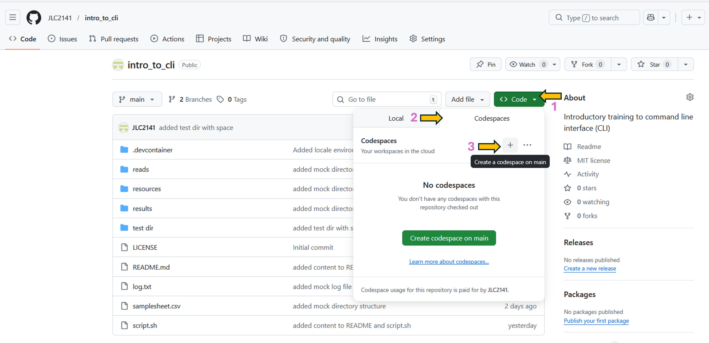

It will take a few minutes to set up your codespace. Once it's ready, you should see the following:

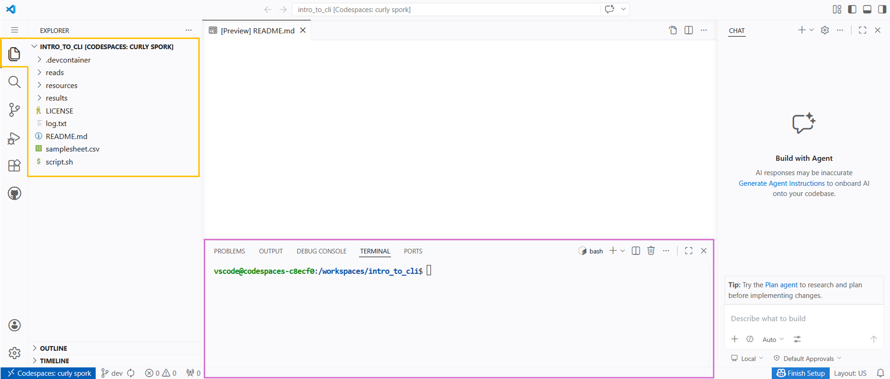

Put simply, GitHub codespaces creates a virtual Linux environment and uses the Visual Studio Code (VS Code) editor as the primary interface.

More on [codespaces](https://docs.github.com/en/codespaces/about-codespaces/what-are-codespaces) and [VS Code](https://code.visualstudio.com/docs/editor/whyvscode), if interested. 

Put more simply, anyone who creates a codespace from this repo will be working within the same exact environment on a similarly simulated computer, putting us all at the same starting point for this tutorial.

> [!NOTE] <br>
> We will also use GitHub codespaces to build and run bioinformatics pipelines during the in-person workshop. <br>
> But, there are other applications on local computer where you can run these commands, as well. For example [terminal](https://en.wikipedia.org/wiki/Terminal_%28macOS%29) on macOS or [WSL](https://en.wikipedia.org/wiki/Windows_Subsystem_for_Linux) on Windows. <br>
> Plus, with codespaces, we can pre-install everything for so you can get right to coding! 


In the image above in the orange box, you'll see the file explorer with the following directory structure:

## 📂 Directory Structure

```
intro_to_cli/
│
├── reads/
│  
├── resources/
│   ├── documentation/
│   │   └── notes.txt
│   ├── metadata/
│   │   └── sample_metadata.csv
│   └── modules/
│       ├── module_1.txt
│       ├── module_2.txt
│       └── module_3.txt
│
├── results/
│
├── test dir/
├── LICENSE
├── README.md
├── log_file.txt
├── samplesheet.csv
└── script.sh
```

---

This parellels to the same functionality you may be used to when, for example, using the file explorer on your computer, such as this:

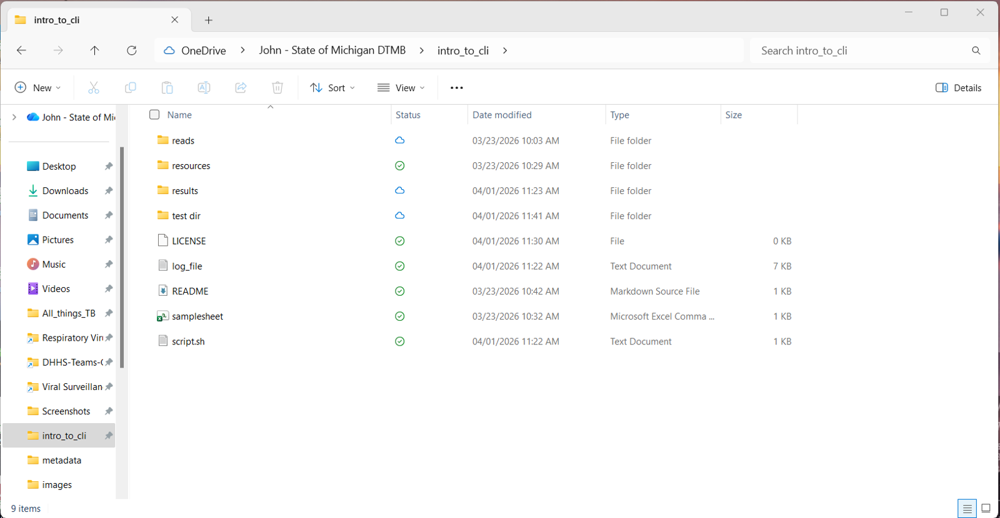

We refer to this as a **G**raphical **U**ser **I**nterface, or GUI (pronounced gooey), for short.

And here's a GUI:

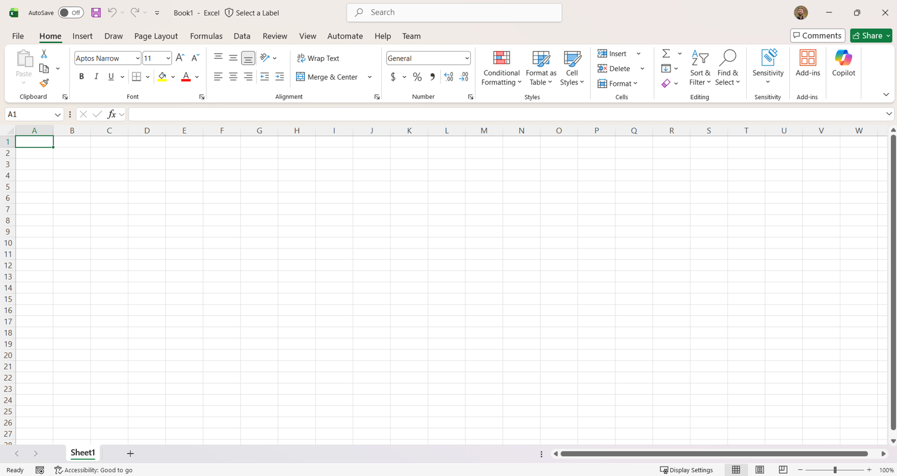

And there's a GUI:

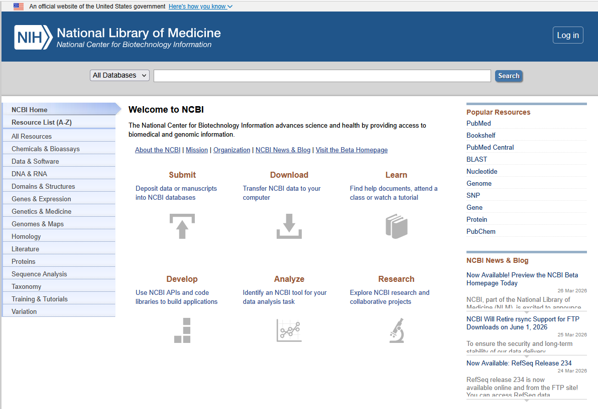

Everything you use to interact with your computer or the web via point and click is a GUI

That's in contrast to the purple box:


This is the terminal application window that allows us to run commands via the command-line interface (CLI), the most common way that bioinformaticians interact with a computer's operating system

Everything you're used to doing here: 


To change folders, make new ones, copy files, move files, etc., you can also perform via CLI. And that's what you'll learn now! 

<br>

Now, back to the purple box two images, above. If your codespace looks like that, then that "$" in the terminal window is a prompt telling us that it is ready to accept commands. So let's get started with CLI! 

<br>

> [!NOTE] <br>
> This is just a test space to learn from.
> Anything you perform in this environment is self-contained and will be deleted at the end of the session.
> Which also means you're free to use this codespace on your own time to explore CLI functionality.


## 📋 CLI command: ls

Before we start, take note of where we are currently located in the file system:

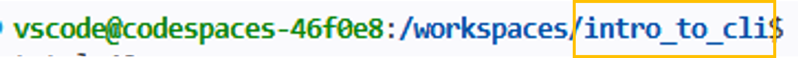

**We are in a directory called intro_to_cli. I will refer to this directory throughout the tutorial as the base working directory.**

Our first command is `ls`, or **l**i**s**t:

```
ls
```

Type this into the command line and press enter ↩

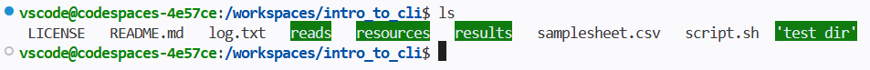

This lists the contents within the intro_to_cli directory and lists the exact same contents you see in the file explorer on the left pane (except for hidden, should I mention that?.) Directories will typically be highlighted or colored while files are not. 

<br>

> [!NOTE] <br>
> Directories and folders are used interchangeably but bioinformaticians generally use the term directories. I will use that terminology throughout this tutorial. 

<br>

The list (ls) command is helpful to view directory contents but we can do more. Go ahead and perform the following command:

```
ls -l
```
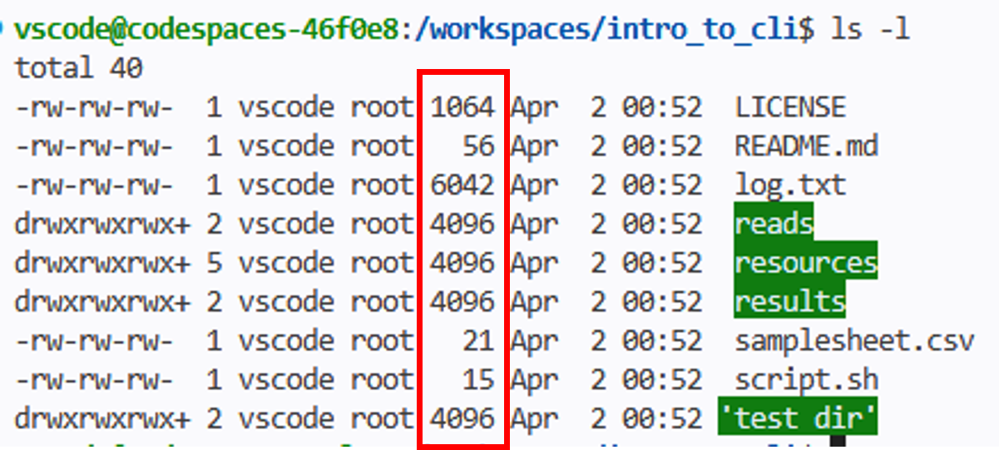

We just added what is known as a flag to the list command. **Flags are used to modify the operation of a command**. The hyphen is a prefix that signals a command line flag will follow and the single character after the hyphen is one type of flag for the list command. 

<br>

> [!NOTE] <br>
> Terminology ramble again: I will use the term "flag" but you may also come across other terms such as an "argument" or an "option".
> You'll also see another type of flag invocation when we get to bioinformatic pipelines: the double dash prefix, "--", uses a multi-character flag that is more descriptive. For example --outdir would be flag specifying the directory where results are output.

This specific flag leads to the output of the ls command in long format, and now we see much more information about these directories and files. Only focus on the red box in the image for now. Can you guess what that is?

<details>
<summary>Reveal solution, here</summary>
That's the file or directory size, in bytes. 
</details>

<br>

These files and directories are generally small at the moment. But what if you had content that was megabytes (MB) or gigabytes (GB) in size? These sizes would become difficult to read. For example, can you tell me what this directory size is? 1397383892. We can figure it out (~1.4 GB) but it's inconvenient to quickly scan when working with a lot of data.

The good news is that we can combine multiple flags! Let's make our lives easier. Enter the following command:

```
ls -lh
```

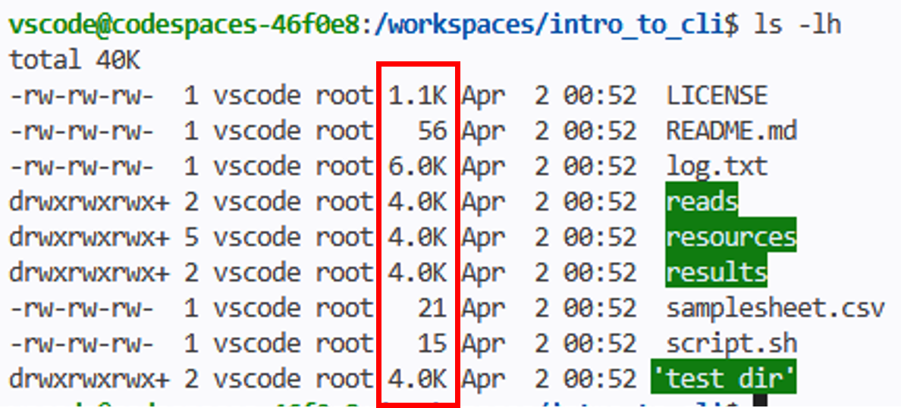


Ah, much better! The h flag outputs file/directory size in human-readable format. We see, for example, that the resources directory is 4.0K or 4 kilobytes. Larger files/directories will have a M or G designation for megabytes or gigabytes, respectively. 

> [!TIP] <br>
> Other useful flags for the list command include -S (sort by size) and -t (sort by time)
> Other commands we'll learn throughout this tutorial also have flags

As stated in the beginning, we are in the intro_to_cli directory and just listed its contents. But what if I wanted to list what was in the resources directory? Enter the following command:

```
ls resources
```

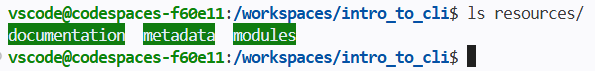

What do we see?

<details>
<summary>Reveal solution, here</summary>
Inside the resources directory, there are three additional directories
</details>

You can use the list command to see what's in your current directory (simply with ls) or, you can further specify which directory you want to list the contents of. 

But what if you wanted to see inside the contents of all directories within the intro_to_cli directory? For that, let's introduce you to the wildcard character🃏. Enter the following:

```
ls *
```

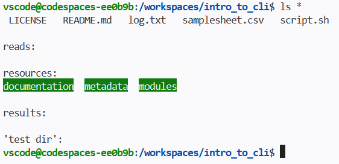

Okay let's break this down
* We see the files listed at the top of the output
* Then, individual directories are listed, as specified by the colon character, revealing the contents within each
* Note that the reads, results, and 'test dir' directories are empty

The wildcard acts as a special character that allows us to, in this case, list everything within intro_to_cli and the contents within (if a directory). In other words, this is equivalent to running: 

```
ls LICENSE
ls README.md   
ls log.txt   
ls samplesheet.csv   
ls script.sh 
ls reads
ls resources
ls results
ls 'test dir'
```

We'll learn more about the utility of the wildcard character later in the tutorial.

Two additional things to note before we move to the next command:

1) Your terminal window is probably getting messy now. If you want a clean slate, enter the following:

```
clear
```

Technically, this is also a command but it is just used to clear your screen.

2) It's okay to type and enter incorrect commands. You might receive a note that the command is not found. For example, try:

```
sl
```

However, if you ever want to cancel your current prompt and generate a new prompt line without entering, just enter:

```
Ctrl+C
```


## 📕 CLI command: man

Now, you might have asked yourself how did I know this awesome information about the flags for list. Over time, you may memorize some useful flags and there's always google. But there's also a command that we can use to view the command manual, or `man`, for short. Enter the following to view the manual for the list command: 

```
man ls
```


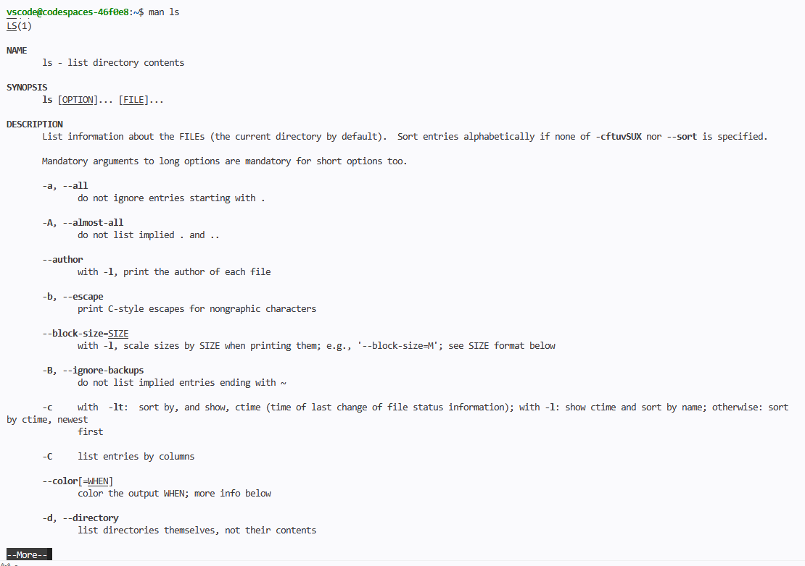


You'll notice this opens a pager window where we can interact and navigate the manual. The "NAME" section displays the command of the manual we're looking at, the "SYNOPSIS" section provides a usage example, and the "DESCRIPTION" section displays the various flags we can use.

Use the ⬆️ and ⬇️ arrows to navigate the manual or use scroll 📜. Can you find the flags we used in the previous command? Here they are!


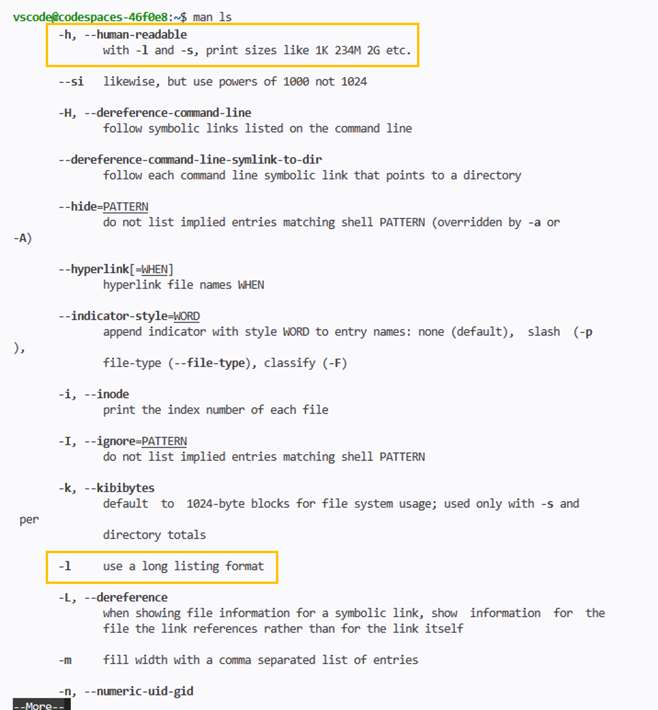

We see the descriptions of these flags, as stated previously. Press:

```
q
```

To exit the manual and return to the terminal prompt. A second way to view the manual is through the help flag succeeding the command of interest. For example:


```
ls --help
```

This just outputs the full manual on the terminal and you have to scroll back up to read from the top. 

Both methods output the same information. Choose your preferred method. 


> [!TIP] <br>
> The man command and --help flag works for other commands we'll learn, too.

## 🎯 CLI command: pwd

Our terminal prompt already gives away our current location in the file system:


However, there is also a command we can use to display this, as well. Enter the following:

```
pwd
```

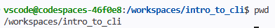

This is the **p**rint **w**orking **d**irectory, or `pwd` command, and is used to print where you are currently working within the file system. Common terminology refers to this as a path, the unique location of file or directory. 

pwd will always print the **absolute** path, starting at the root "/" directory.

So, let's break down this path:
* We start at root "/"
* We then navigate into a directory called workspaces
* Finally, we navigate into a directory called intro_to_cli

Notice that in Linux, forward slashes are used to navigate the file system hierarchy:

```
/directory/directory/directory/
```

pwd provides the directory path but we can also use paths to specify a file, too. 

```
/directory/directory/directory/file.txt
```

We'll make use of this with other commands.

Lastly, the **absolute** path is in contrast to the **relative** path, which is the path specification starting from your current working directory.

Take the previous example when we listed the contents within the intro_to_cli directory.

If we were to specify:

```
ls resources/
```

We are specifying a relative path relative to intro_to_cli. **Relative paths do not contain a forward slash at the beginning**. Notice that we could have also specified the absolute path: 

```
ls /workspaces/intro_to_cli/resources
```

Both work, but using a relative path is generally easier when using commands.

> [!NOTE] <br>
> The last forward slash when we specify a path is optional

In summary:

* pwd displays where you are currently located in the file system
* The absolute path is the full path to your current working directory or a file **from root**
* The relative path is a path relative to your **current working directory**
* /Paths/are/provided/with/forward/slashes/
* Remember the difference between **absolute** and **relative** because we will make use of paths from here on out.

<br>

> **Challenge: With what we learned so far, can you use a relative path to list all the contents within resources to reveal what is inside those directories?**

<br>

<details>
<summary>Reveal solution, here</summary>

```
ls resources/*
```
And you should see:

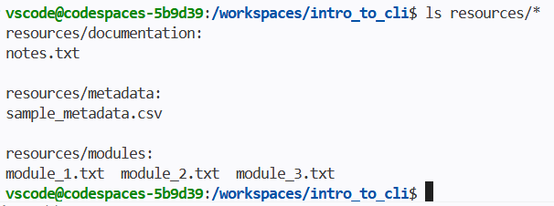

</details>

<br>

## 📂 CLI command: cd

We will now learn how we can navigate the file system.

Recall when we looked at the contents of our current working directory, intro_to_cli:


We saw that there were other directories. We can navigate or change into these directories using the `cd` or **c**hange **d**irectory command. Let's change directory into the resources directory:

```
cd resources
```

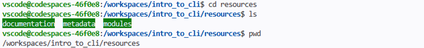

To some extent, the cd command is equivalent to you double-clicking folders on your file explorer.

You'll notice the command prompt shows we successfully navigated into resources. But, I followed the cd command with two commands we learned prior, ls and pwd, to look at the contents within resources and re-confirm our new working directory, respectively. We see that the resources directory contains 3 additional directories. 

It is common to refer to the navigation we just performed as "going down" because we are going down into directories relative to the hierarchal structure of the file system starting at root. 

We can also go back, or up directories using the cd command. We also refer to this as parent directories. For example, intro_to_cli is the parent directory of resources because it is contained within intro_to_cli. Likewise, workspaces is the parent directory of intro_to_cli.

From resources, to navigate back to the parent directory, intro_to_cli, we use the following command to change one directory up:

```
cd ..
```

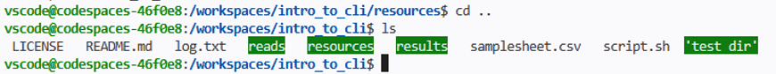

The ".." refers to the parent directory. Again, succeeding the cd command, I used ls to list the contents of intro_to_cli to help reconfirm that our change directory command was successful. 

I will mention this here since we're on the concept of dots. A single dot succeeding a command:

```
cd .
```

Represents the current working directory. It's like a way of saying, "here". It's not as useful with the cd command because you're already where you want to be, but we'll make use of this single dot later in the tutorial. 


### Concept checks and tips

#### 1) Within intro_to_cli as your current working directory, why doesn't the following work?

```
cd /resources 
```

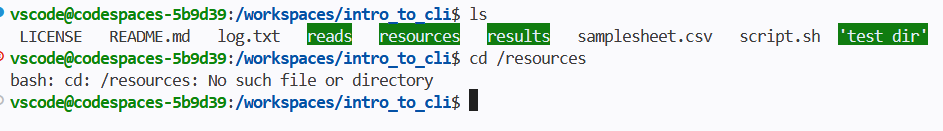

<details>
<summary>Reveal solution, here</summary>

<br>

Because you're specifying at root with the forward slash. So while you're trying to change directory within intro_to_cli, the command is trying to find a resources directory at root, which doesn't exist. 

List at root to confirm that:

```
ls /
```
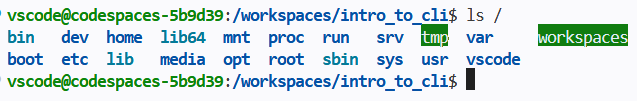

</details>

<br>

#### 2) You can traverse multiple directories at a time using the cd command. For example, say our current working directory is intro_to_cli and we want to navigate into the documentation directory that's located inside of the resources directory. We *could* perform the cd command in two consecutive steps:

```
cd resources
cd documentation
```

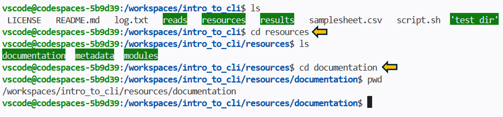

It works fine! And we can navigate back to intro_to_cli using the same approach:

```
cd ..
cd ..
```

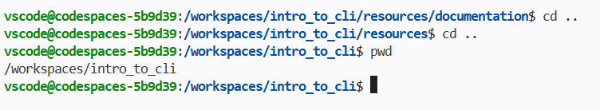

But a more efficient way of navigating is using the cd command and then providing the relative path to navigate in one succinct step:

```
cd resources/documentation
```

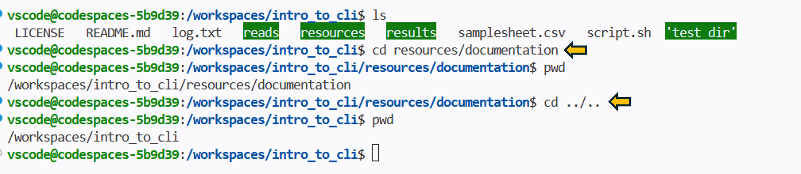

The same concept applies for navigating back up directories, as also shown in the image:

```
cd ../..
```

**You can navigate anywhere you want with one command if you know the relative path.** 

#### 3) Type paths faster by tabbing out for auto-completion

Change into the resources directory:

```
cd resources
```

Now, say we wanted to change into the documentation directory. Start by just typing the following: 

```
cd d
```

And then press the tab key. What do you notice? The path should have autocompleted to:

```
cd documentation/
```

Tabbing makes path navigation faster. Use it so you don't have to type everything out. 

Navigate back to the intro_to_cli directory, then try tabbing out to achieve the following path:

```
cd resources/documentation
```

As we started off before, start by typing the following:

```
cd r
```

Then press tab. What happened this time?

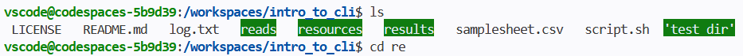

We only see "re" and if we try to hit tab again, it almost feels like it's stuck, right?

Attempt to hit tab twice:

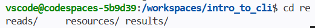

Can you work out what the issue is, here?

<details>
<summary>Reveal solution, here</summary>
There are 3 unique directories that all start with 're' so autocomplete can't complete when there are technically 3 options we could navigate into.

We need to specify enough unique characters so that tab can autocomplete.

In this case, type the following:

```
cd reso
```

And then hit tab. And then you should see:

```
cd resources/
```

Now continue typing

```
cd resources/d
```

Now hit tab:

```
cd resources/documentation
```

</details>
<br>


**Using relative paths and tabbing out will really increase your efficiency on the command line. I suggest using both of these techniques moving forward as we learn other commands**

#### 4) The home directory

Enter the following command:

```
cd
```
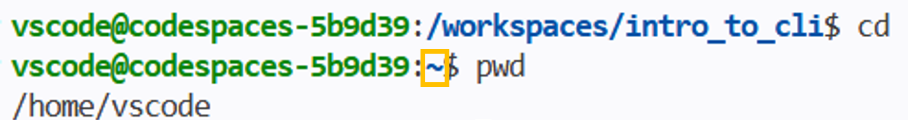

What do we see? We have been automatically navigated to a home directory:

```
/home/vscode
```

Where vscode is your assigned user name in the codespace. This is how Linux sets up home directories by default. See more [here](https://refspecs.linuxfoundation.org/FHS_3.0/fhs/ch03s08.html) if you want to learn more about the home directory.

In the image (orange box), you'll also notice that the path on the command prompt is a tilde, ~. This is also default Linux behavior. The ~ is the same as specifying your home directory path meaning:

```
cd ~
```

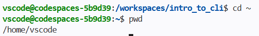

Navigates you to the same location as just typing:

```
cd
``` 

I only mean to cover this topic because you may accidentally enter cd and be navigated away from our base working directory (/workspaces/intro_to_cli).

Don't panic! With the knowledge you gained so far, how would you navigate back to the base working directory?

<details>
<summary>Reveal solution, here</summary>

```
cd /workspaces/intro_to_cli
```

Remember, this time we needed to provide an absolute path with the forward slash at the beginning because the most common parent directory between:

```
/home/vscode 
```

and

```
/workspaces/intro_to_cli
```
is the root directory.

</details>


**Moving forward, I will use the term base directory to refer to the intro_to_cli directory for purposes of simplicity. So if the tutorial states, "perform this command while located in the base directory", I mean perform a command while you're in /workspaces/intro_to_cli/**

## 📁 CLI command: mkdir

Okay, that was a lot but you're doing great! Let's keep rolling with the next command, `mkdir` or **m**a**k**e **dir**ectory.

Confirm that you are in the base directory and make a new directory called "test_dir":

```
mkdir test_dir
```

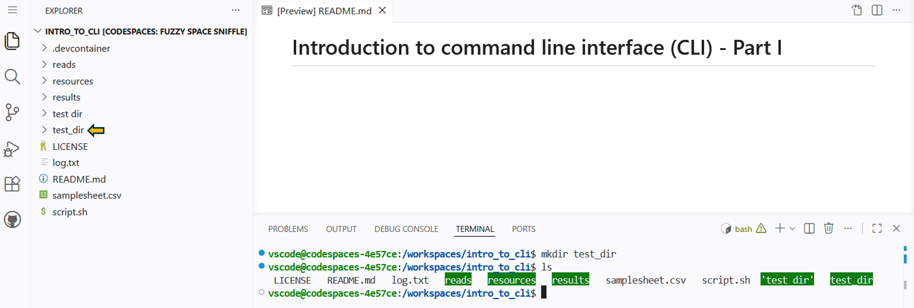

After this command I ran ls to look at the contents and we do indeed see the creation of a new directory called "test_directory". You should also see it on your file explorer pane on the left side bar (orange arrow).

So this brings us to our discussion on naming files and directories. Notice there was another directory already present in the base directory named 'test dir'. 

This is also a directory with the only difference being that a space was added in the naming scheme of that directory while an underscore was added in the directory we just created. 

Attempt to change directory into the test_dir directory containing the underscore:

```
cd test_dir
```

Okay, now navigate back to the base directory,

<details>
<summary>Recall if you need help, here</summary>

```
cd ..
```

</details>

And attempt to change directory into the 'test dir' directory with a space. There are two ways:

```
cd test\ dir/
```

or

```
cd 'test dir'
```

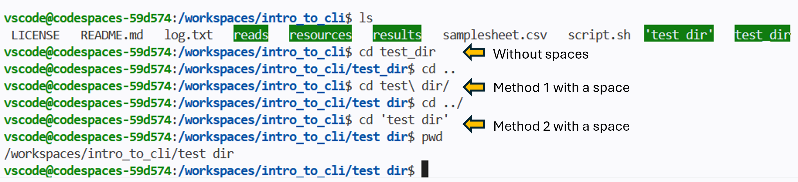


Both work but I have to admit, the solutions to navigate into a directory with spaces are both pretty ugly. Directories and files with spaces in the name can complicate your ability to specify a path and will cause unnecessary headaches in your coding scripts.

**Abide by best practices and always place an underscore or a hyphen between words when naming a file or directory. In addition, stick to lowercase, only. The naming convention for hyphen delimiters and underscore delimiters is called kebab-case and snake_case, respectively.** 

**Another naming convention is called camelCase, where the first word is lowercase, and first letter of subsequent words are capitalized, like this: myDirectoryName.**

Personally, I prefer snake case because I don't like capitalization in my naming.

Okay, return to your base directory. Attempt to create a new directory called scripts within a directory called bin:

```
mkdir bin/scripts
```

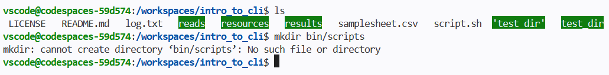

Oops! Looks like this returned an error that no such file or directory exists. Can you understand why this didn't work?

<br>

<details>
<summary>Reveal solution</summary>
This pertains to the bin directory. The scripts directory could not be made because the bin directory was not present in the first place. 
</details>

<br>

Let's view our handy-dandy manual for mkdir and see if we can find some help:

```
man mkdir
```

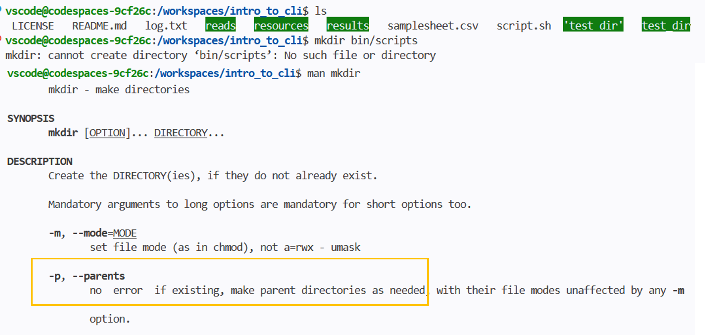

Now we're talking! The p flag is exactly what we need. Because bin is the parent directory of scripts, the p flag will make sure to create this parent directory, if not already present, to then allow the scripts directory to be made.

Knowing this information, take a moment to try to create the scripts directory as we attempted before, except this time also use the p flag.

<br>

<details>
<summary>Reveal solution</summary>

<br>

```
mkdir -p bin/scripts
```

<br>

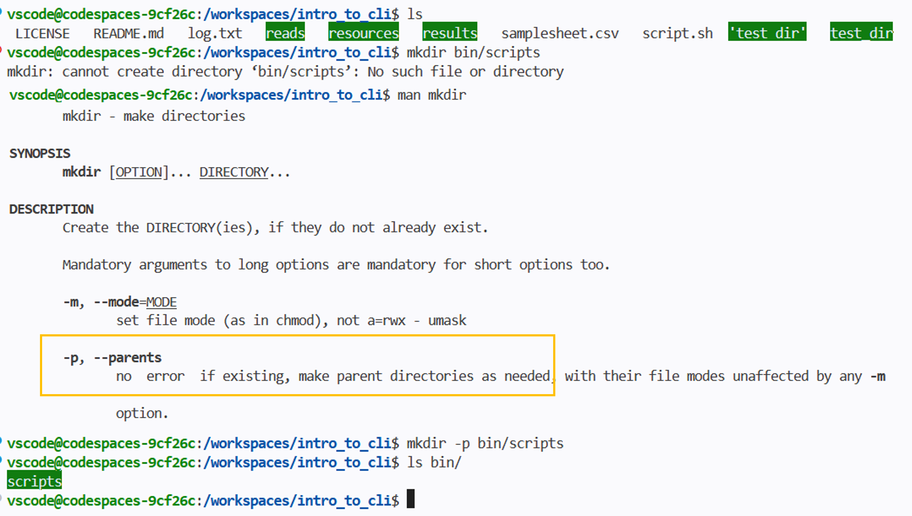

<br>

Voilà, it worked!

You should notice that the bin directory was made in the base directory and then the scripts directory was made inside bin directory (the parent directory).

<br>

</details>

<br>

## 📃 CLI command: touch

You can make new files, just like we made new directories in the previous command we learned. For new files, we use the `touch` command:

```
touch test_file.txt
```

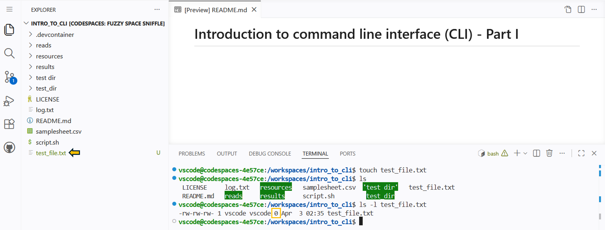

I also performed some additional commands proceeding and succeeding the touch command to show that file wasn't initially present and then confirm the creation of the file. We see that the file we just created is an empty file. And, we also confirm the creation of the file via the file explorer pane on the left side bar (orange arrow).

**Challenge: Using a relative path, create another test_file.txt in the documentation directory**

<br>

<details>
<summary>Reveal solution, here</summary>

```
touch resources/documentation/test_file.txt
```

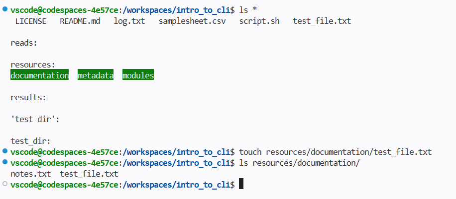

I first ran the:

```
ls *
```

command to recall where the documentation directory is. We see it present in the resources directory. 

The touch command was then run, providing the relative path to the documentation directory followed by the file name, as shown as the main solution when this section was first revealed: 

```
touch resources/documentation/test_file.txt
```

Lastly, the ls command was run with the relative path to the documentation directory to confirm creation of the new file:

```
ls resources/documentation
```

</details>

<br>

## ↔️  CLI command: mv

### Moving files

While you're probably used to dragging and dropping to move things on file explore, we'll make use of the **m**o**v**e `mv` command to move a file. For this, we need to specify to key aspects after the move command. For example:

```
mv file directory
```

First, we specify the file that we want to move. Second, we specify where we want to move it to. The "where" is typically a new directory. For example, from our base directory, let's move the test_file.txt we created in the previous command to the test_dir directory:

```
mv test_file.txt test_dir
```

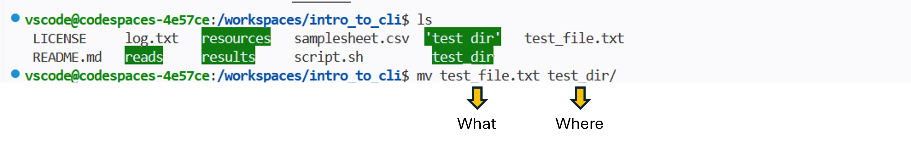

If we run:

```
ls
``` 
in the base directory and

```
ls test_dir
```

we see that the file was successfully moved.

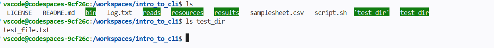

>⚠️ **Caution:** Moving a file into a directory with a file containing the same name will automatically overwrite the file. <br>
>⚠️ **Caution:** There is no undo (ctrl+z) once this command executes.


For example, let's make a new file also called test_file.txt *in the base directory*:

```
touch test_file.txt
```

Recap: we have a file named test_file.txt in the base directory and another file also named test_file.txt in the test_dir directory. 

Just as we did before, move the test_file.txt from the base directory into the test_dir directory:

```
mv test_file.txt test_dir/
```

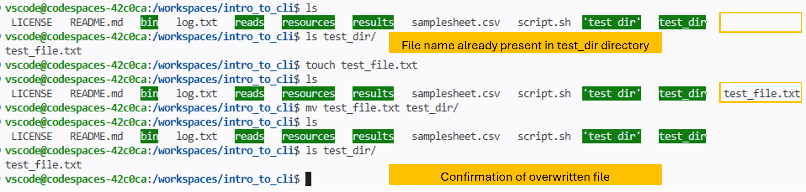


Notice how we had two files but now there is only one file in the test_dir directory. The original test_file.txt was just overwritten.

**Files with the same name will automatically be overwritten with the mv command.**

However, there is flag we could add to prevent this from happening. How could you look into finding a way to stop an automated file overwrite? 

<details>
<summary>Reveal solution, here</summary>

Look at the manual for the move command to uncover different flags!

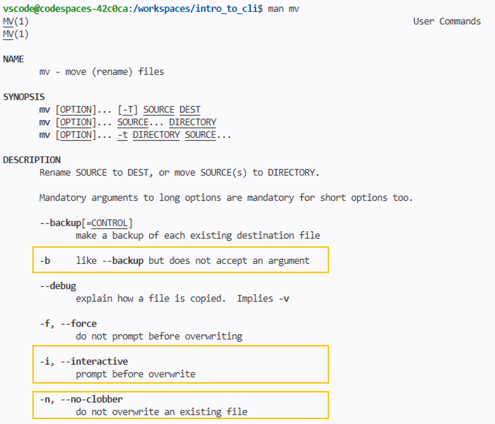

I've highlighted three potential flags:

1) -b: make a backup in case of overwrite.
2) -i: provide a prompt prior to an overwrite to allow user confirmation.
3) -n: prevent overwite outright.

All of these flags provide viable solutions. I encourage you to explore these flags on your own free time. 

</details>

### Renaming files with the move command

**Moving a file within the same directory will rename the file**

While in a directory of interest, you can use the move command as such:

```
mv old_file_name.txt new_file_name.txt
```

where the first input is the file name you want to change and the second input is the new name of the file.

Change directory into test_dir:

```
cd test_dir
```

and then change the test_file.txt to new file name. For example:

```
mv test_file.txt new_file_name.txt
```

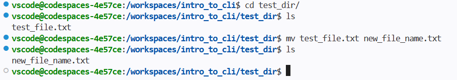

I also ran the list command (ls) afterwards to confirm that the file name change was successful. 

### Moving directories

Okay, so far we learned that you can use the mv command to:

* mv a file into a different directory
* rename a file within the same directory

And now, we'll learn that you can also use the move (mv) command to move a directory. This simply takes the form of:

```
mv directory_to_move directory_to_move_to
```

where the first input is the directory that you want to move and the second input is the directory location where you want to move the first input to.

With this knowledge:

Take a moment to: 
1) Move the bin/ directory into test_dir/
2) Then, move the scripts/ directory into test_dir/

**Recall, the scripts directory is inside of the bin directory**

<details>
<summary>Reveal solution, here</summary>

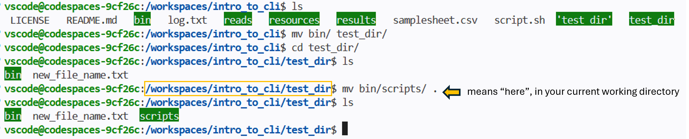

In this example, I:
1. Moved the bin/ directory into test_dir/
2. Changed into the test_dir/
3. Moved the scripts directory, specified by a relative path, to the test_dir using the single dot ,"here", specification 
4. Confirmed successful move

**Recall that the single dot (.) is a way to specify the current working directory. At the time the command was run, I was located in test_dir so . equals /workspaces/intro_to_cli/test_dir**

*I showed you a solution*, not the only solution. Here's another way:

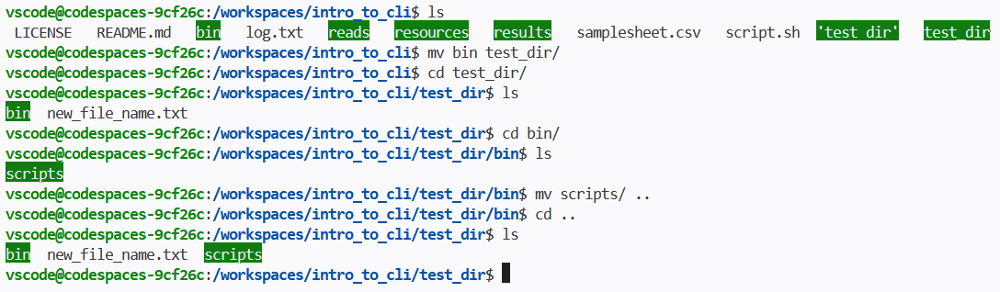

In this example, I:
1. Moved the bin/ directory into test_dir/
2. Changed into the test_dir/
3. Changed into the bin/ directory
4. Moved the scripts/ directory up to the parent directory (test_dir/)
5. Changed directory up into the test_dir/ to confirm successful move

**This solution took more steps but it is not wrong. With the knowledge you're gaining with CLI, start to make the connection that there are multiple ways to achieve the same goal.**

</details>

## 📄 CLI command: cp

### Copying files

Similar to the move command, we need two inputs for the **c**o**p**y `cp` command. For example:

```
cp file_to_copy where_to_place_copy
```

where the first input is the file we would like to copy and the second input is the location we want to place that copy. 

From the base directory, let's make a copy of the samplesheet.csv file and place it into the test_dir directory:

```
cp samplesheet.csv test_dir
```

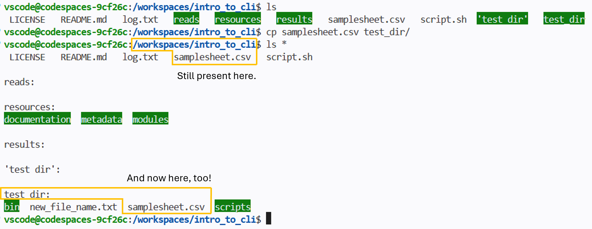

I also performed the:

```
ls *
```

command succeeding the copy (cp) command to confirm that:
1) samplesheet.csv is still present in the base directory
2) And now a copy of that samplesheet.csv is now present in the test_dir directory

Recall the wildcard character (*). We can also use that to copy a selection of files.

We're going to put a few tips and lessons we learned so far in this next task to copy all contents from

```
/workspaces/intro_to_cli/resources/modules/
```

to 

```
/workspaces/intro_to_cli/test_dir/bin/
```

The steps achieve this task are:
1) Start with the copy command and then use relative paths to specify the directory containing the files of interest:

```
cp resources/modules/
```

2) Use the wildcard character to select all contents in the modules directory

```
cp resources/modules/* 
```

3) Start typing the relative path of the location, which starts with the test_dir, followed by a double-tab to reveal the contents of test_dir

```
cp resources/modules/* test_dir/
```

4) You should see the bin directory. Finish the relative path in the second input and enter the complete command:

```
cp resources/modules/* test_dir/bin/
```

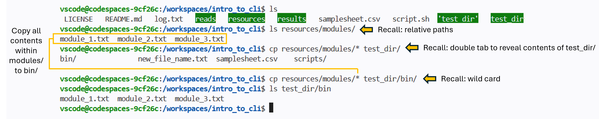


Confirm to yourself that this copy command was successful. 


### Deeper dive into the wildcard

Now, what if there were other files within modules/ directory? For example:

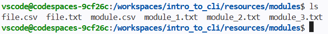

Change directory into the resources/modules/ directory: 

```
cd resources/modules
```

and create the following files- module.csv, file.txt, and file.csv:

```
touch module.csv
touch file.txt
touch file.csv
```

How would you use the wild card character (*) to: </b>

1. Only list files starting with "m"?
2. Only list txt files?
3. Only list the module_1.txt, module_2.txt, and module_3.txt files?


While inside of the /workspaces/intro_to_cli/resources/modules directory, attempt the 3 tasks, above.

**Hint: Use as many unique characters before or after the wildcard character to list files of interest**

<details>
<summary>Reveal solution, here</summary>

Again, wildcard alone lists all everything:

```
ls *
```

But now, we can add characters to limit what the wildcard selects. For example, in task 1:

```
ls m*
```

we place a "m" before the wildcard to list all contents starting with the letter m. In task 2:

```
ls *.txt
```

we place a ".txt" after the wildcard to list all files ending with that file extension. In task 3:

```
ls m*.txt
```

we place a "m" before and ".txt" after the wildcard to only specify files txt files that start with the letter "m".

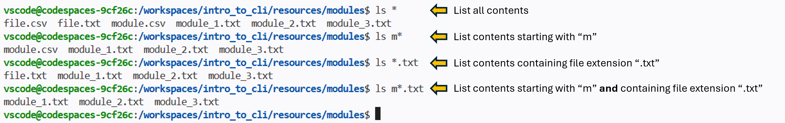

Hopefully the versatility of using the wildcard is starting to make sense!

</details>

<br>

As you can see, we performed this with the list (ls) command. The wild card character can be used with a variety of commands including: 

* ls 
* mv
* cp
* rm

**Or, when we're running a bioinformatics program and we want to process all FASTQ files within a directory.**


### Copying directories

Alright, as we saw with move, we moved both files and directories, and we can do the same with copy! From the base directory, let's try to copy the resources/ directory into the test_dir/ directory:

```
cp resources/ test_dir/
```

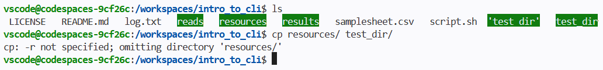

Oops! We ran into an error and the command execution failed. It states that the flag "-r" is not specified, but what does that mean? Let's check the manual:

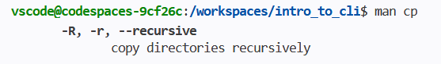

The "-r" flag stands for recursive and is required when copying directories because it is essentially telling your computer to copy the directory **and** everything inside it. 

It failed without the "-r" flag because cp only works at a single level and because the resources/ directory contains contents, the "-r" flag is used to permit traversing the entire directory tree within resources/

**Recall: exit the manual by just typing "q"**

Let's re-try the copy command with the recursive flag:

```
cp -r resources/ test_dir/
```

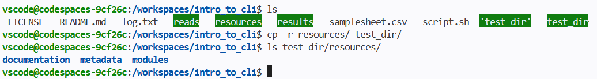


Success!

## 🗑️ CLI command: rm

### Removing a file

The **r**e**m**ove `rm` comand is used for the removal of files and takes the general form:

```
rm file_to_delete.txt
```

where the input following the command specifies the file you want to remove.


Within the base directory, let's go ahead and specify the samplesheet.csv file for deletion.

>⚠️ **Caution:** This action will delete all files (and directories) permanently. <br>
>⚠️ **Caution:** There is no recycle bin or undo (ctrl+z) when deleting via the CLI.
>⚠️ **Caution:** Always double check that you are deleting the correct content before executing the command

```
rm samplesheet.csv
```

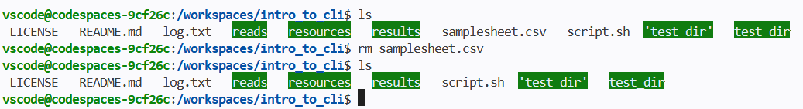

And we see it's gone! Never to return!

### Removing a directory

I'm sure it's been bugging you like it's bugging me. That pesky 'test dir' directory with a space in the name. 

You:


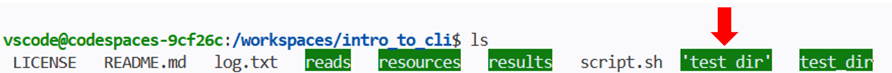


Yea you, your time is up. We know better now than to name our files and directories with a space

> [!TIP]
> Always add a hyphen "-" or an underscore "_" when naming to simplify navigating paths (e.g. this_is_a_good_file_name.txt).

Let's remove that directory:

```
rm 'test dir'/
```

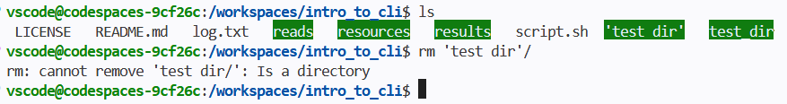


Not again! 🤦‍♂️ Can you recall the flag we need to add in order to delete a directory?

<details>
<summary>Reveal solution, here</summary>

The recursive flag "-r"! 

```
rm -r 'test dir'/
```

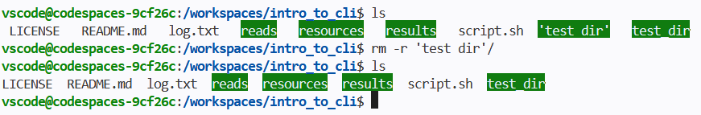

And we see that the directory is gone. The directory was empty, but it doesn't matter. You need to add the recursive flag with trying to delete (or copy) a directory.

</details>

<br>

Okay, 'test dir' was empty but let's try to remove a directory with contents in it. Let's remove the test_dir/ directory:

```
rm -r test_dir/
```

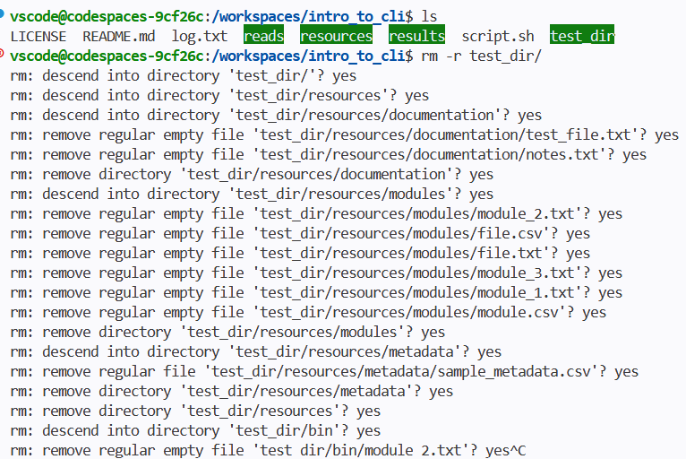

Okay, I give up. I cancelled the command with:

```
ctrl + c
```

You see, each line was a prompt, asking if I wanted to delete a particular file or directory within the test_dir/:

* I had to type "yes" and hit enter, over and over again to confirm deletion
* This is time consuming if the directory has hundreds of contents

Add the force (-f) flag in combination with the recursive (-r) flag to remove prompts and delete the directory:

```
rm -rf test_dir/
```

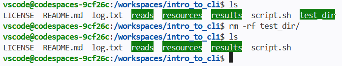

There! In summary the recursive (-r) flag is required to delete directories and the force flag (-f) ignores prompts when you want to delete a directory containing multiple contents.

<br>

>⚠️ **Caution:** Do not run a command such as:
> ```
>rm -rf *
>```
> ⚠️ **Caution:** Unless you are certain of where you are currently located in the file system <br>
><br>
> **And definitely do not ever run**:
>```
>rm -rf /
>```
> ⚠️ **Caution:** Because this would delete everything starting at the root directory...so all contents on your computer.<br>
>There's typically a built-in safeguard if you try to remove from the root but it's best not to use that command at all

> [!NOTE] <br>
> Most institutions will typically have backups in place to recover files in case of an accidental deletion.
> But still, save the headache of backup and recovery (and your relationship with IT) by always thinking twice before running `rm -rf`.
> And again, this codespace we're currently working in is just a test space so feel free to make mistakes! We're all learning here!

## 🔍 CLI command: cat, less, head, tail

We will now explore various techniques to view a file. 

### cat 

The first is `cat`, short for concatenate. This will read and write the entire contents of a file to your terminal if you type:

```
cat file_name.txt
```

For example, let's look at the contents of the log.txt file:

```
log.txt
```

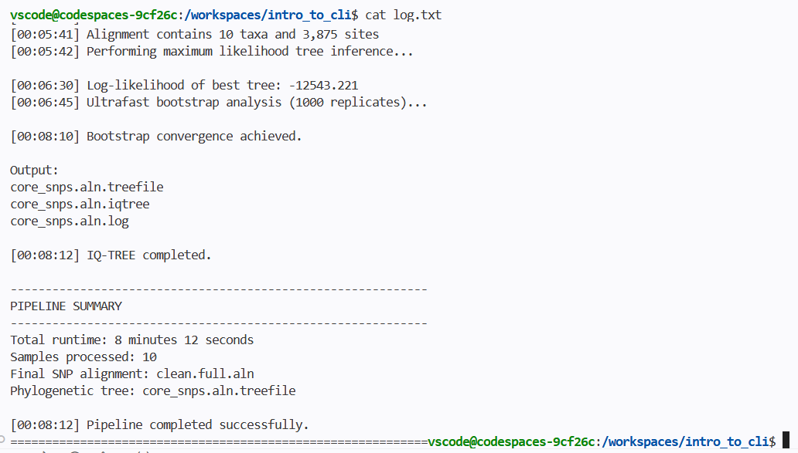

You'll notice this is only an image of the end of the file because it's a relatively long file. You can scroll up and down to navigate the contents.

> [!NOTE]
> This is just a mock log file of a bioinformatics pipeline

### less

However, sometimes files may be thousands of lines long and you want more fine-tuned control of the navigation. For this we can use the command, `less`.

```
less log.txt
```

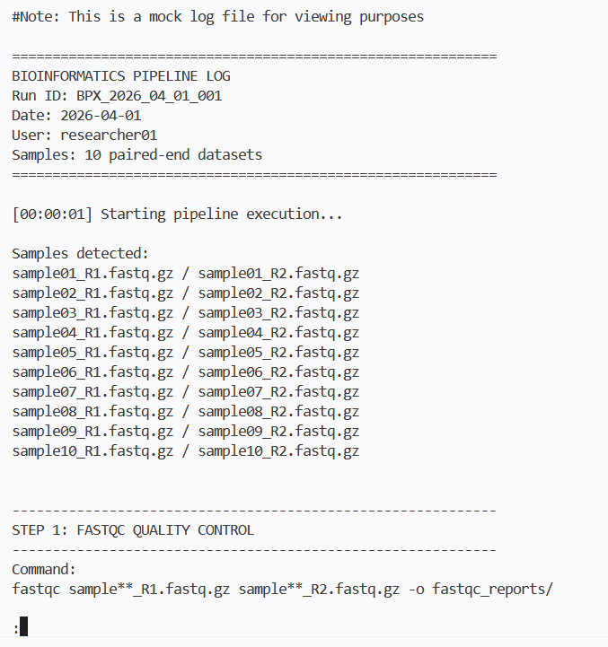

In contrast to cat, you'll notice the less command opens a full-screen terminal pager window that does not display the entire file. You start at the beginning of the file and can navigate with scroll. You can also search key words, for example, by entering the following: 

```
/STEP 4
```

requiring the "/" character for search results below your current location in the file or:

```
?BIOINFORMATICS
```

requiring the "?" character for search results above your current location in the file.

To exit terminal pager window, just type: 

```
q
```

### head

Sometimes, you just want to view the first part of a file. For example, the beginning of a log file to view summary information about a run. 

For this, we use the `head` command

```
head log.txt
```

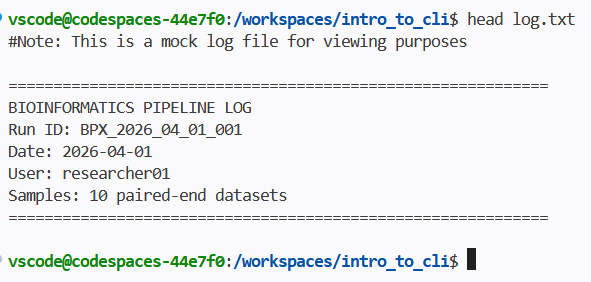

By default, the head command will display the first 10 lines of your file.

If you want to display more lines, the first 20 lines for example, use the -n flag followed by the number of lines:

```
head -n 20 log.txt
```

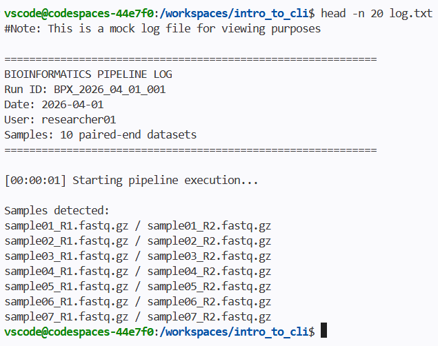

And now we've displayed the first 20 lines of the log file.

### tail

Other times, you may want to only view the end of file to view, for example, to make sure that your bioinformatics pipeline completed successfully. For this, we use the `tail` command: 

```
tail log.txt
```

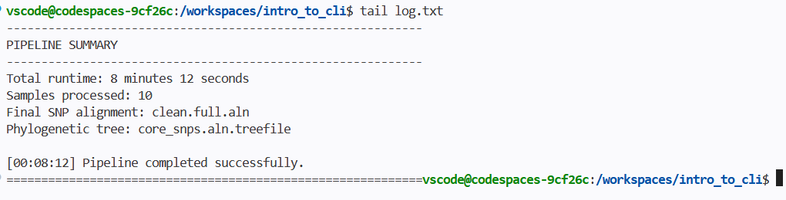

> [!NOTE]
> Tail also works with the -n # of lines flag as shown with the head command.

**Note, these are various methods to use commands to view a file. However, you're more than welcome to take advantage of the VS Code interface to view files, too. Click on the log.txt file on the left side bar panel to view the file via VS Code.**


## 📝 CLI command: nano

`nano` is a text editor for Linux. Think of it like the notepad app you may be familiar with: 

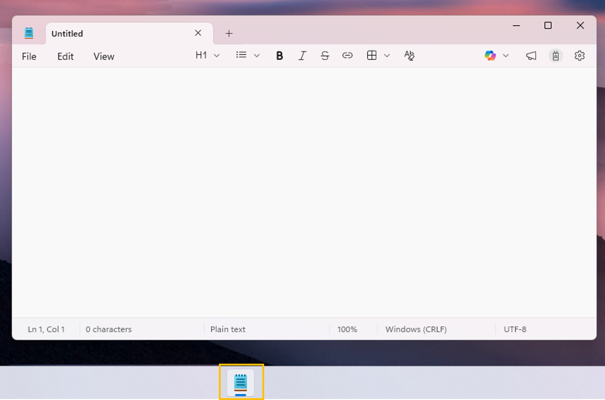

We can start with the command and the name of the file we want to create.

```
nano test_file.txt
```

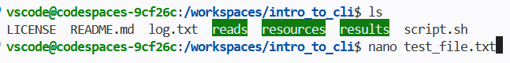

Press the enter key ↩

This initiates the editor. 

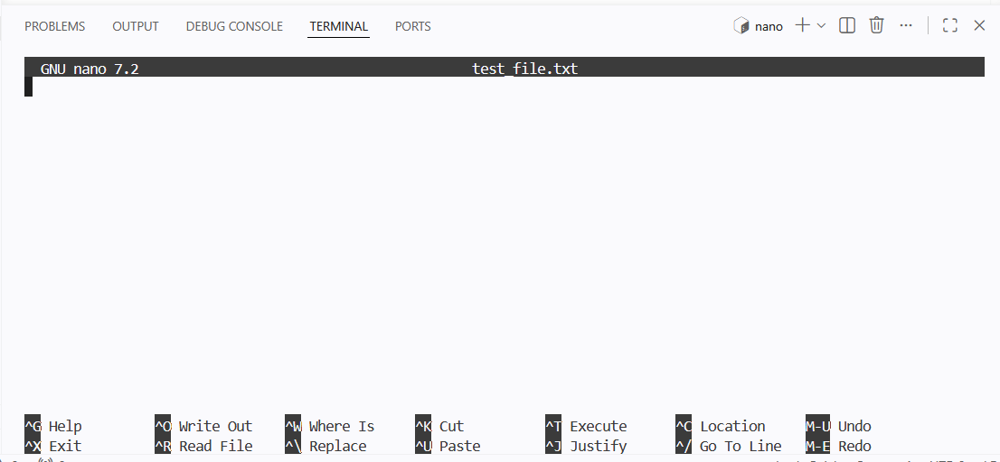

Add some notes to the first line. For example:

```
This is a test file.
```

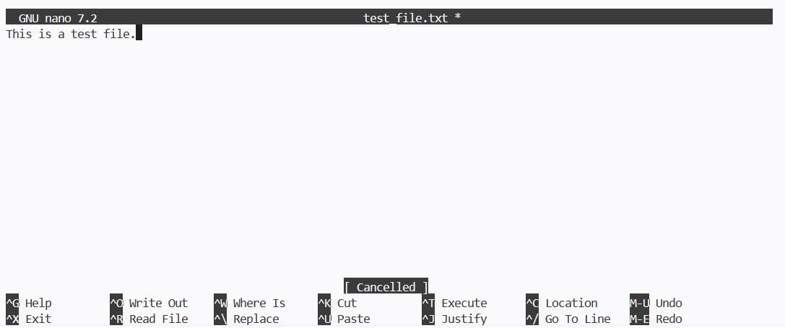


Now, let's try to save our new file. Press:

```
ctrl + x
```

To initiate exit. 

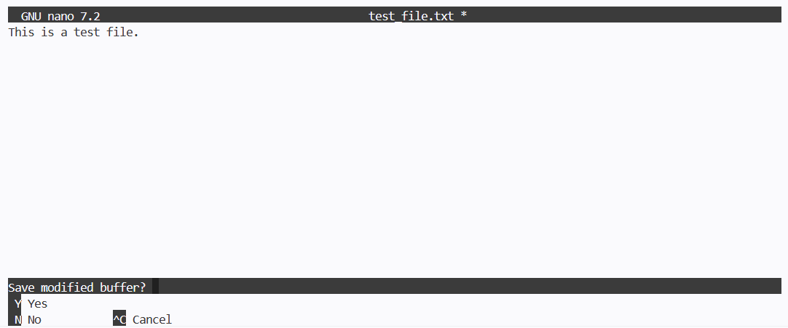

The editor prompt asks if we want to save. Press:

```
y
```

The final prompt allows us to name our file. 

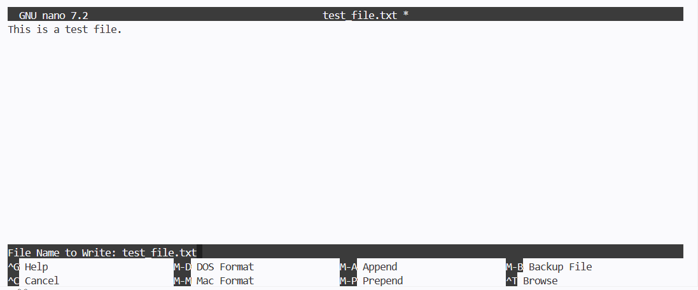

We don't need to change the name. We already named it when we executed the nano command. Save the file by pressing the enter key ↩ and exit the editor. 

Verify that your file has been created.

```
ls
```

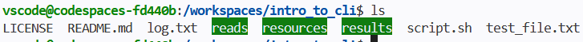


And view the final with any method you prefer:

```
head test_file.txt
```

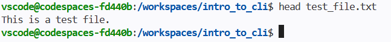

Success! 

> [!NOTE]
> You can also edit files that have already been created.
> Try editing the test_file.txt again, add a second line, save, and view the file.

Where the nano editor really shines is when we want to create scripts to automate processes, as we'll see in the next section. 

## 🏃 CLI command: bash

Why create a script? We like automation for reproducibility and efficiency, and it just makes sense for throughput when you're going to be repeating an analysis on a regular basis.

A script is already in the intro_to_cli/ directory, aptly named, script.sh.

Let's start the script with the `bash` command:

```
bash script.sh
```

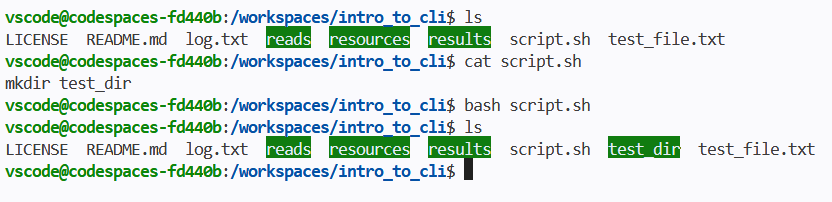

Notice in the image above that I first looked at the contents of the script prior to running the script. We see that it was a one line command to create a test_dir/ directory. 

The command line prompt "$" will appear on a new line once the script is complete. However, we can also add another command within the script to reassure us the script completed. 

> [!NOTE]
> The .sh extension is just convention. Other file extensions are also compatible with running the bash command 
> But, imagine one day someone will look at your code and try to understand how it functions.
> Coding standards make reading code more streamlined and so the .sh extension tells others to look there for automated scripts

<br> 

> **Final concept check challenge**

Take some time to re-edit the script.sh file to achieve the following objectives:

* Make a comment where they should take advantage of vs code text editor. Click on the file and use the VS code

1) Remove the first line
2) Make a new line that moves the test_file.txt into the results/ directory
3) Then, using relative paths, list the contents of test_file.txt in long format and make the output human-readable
4) Provide a message at the end of the script that says the script is completed

> [!TIP]
> Start each command on a new line

<br>
<details>
<summary>Reveal solution, here</summary>

```
mv test_file.txt results
ls -lh results/test_file.txt
echo "Script completed"
```

And showing this on the CLI:

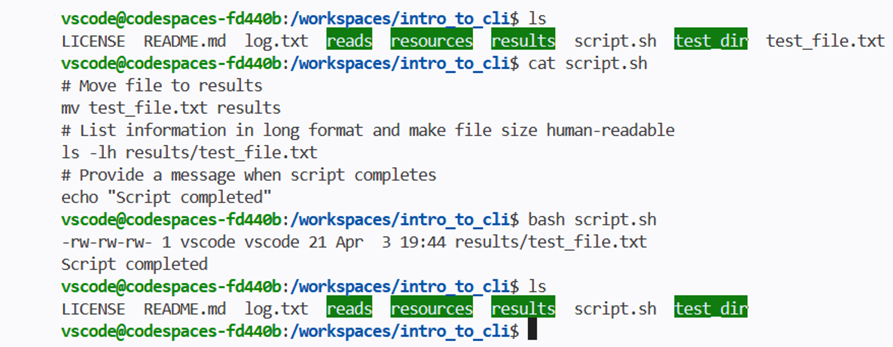

> [!NOTE]
> Notice the hashed (#) lines in the image (orange arrows)
> The hash prevents the lines from being read and executed in the script
> Use hash lines to provide a human-digestible comment on what your code is doing

</details>

<br>

It's okay if you didn't get the last line. The point of this exercise is that you're not always going to have me. So I want to take this moment to introduce you to someone much smarter than me:

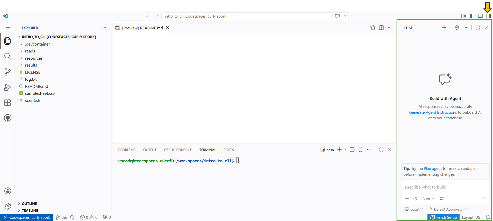

On the right in the green box is [GitHub Copilot](https://docs.github.com/en/copilot/get-started/what-is-github-copilot), an AI coding assistant.

**If you do not see this window, then click on the "toggle secondary side bar" icon (orange arrow)**


And then set the following preferences: 

1. Set the agent to "Ask"

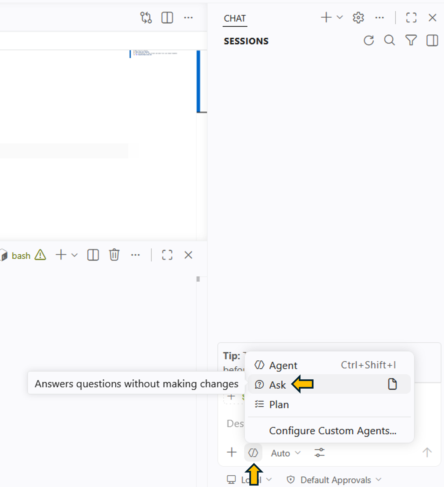

Agent will try to change your code automatically while agent will just provide suggestions.

If you do not see this as an option, try to search for "> ask" in the search bar and select the "Chat: Open Chat (Ask)" option:

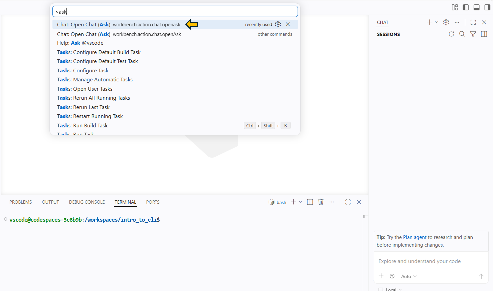


2. Set the model to Claude

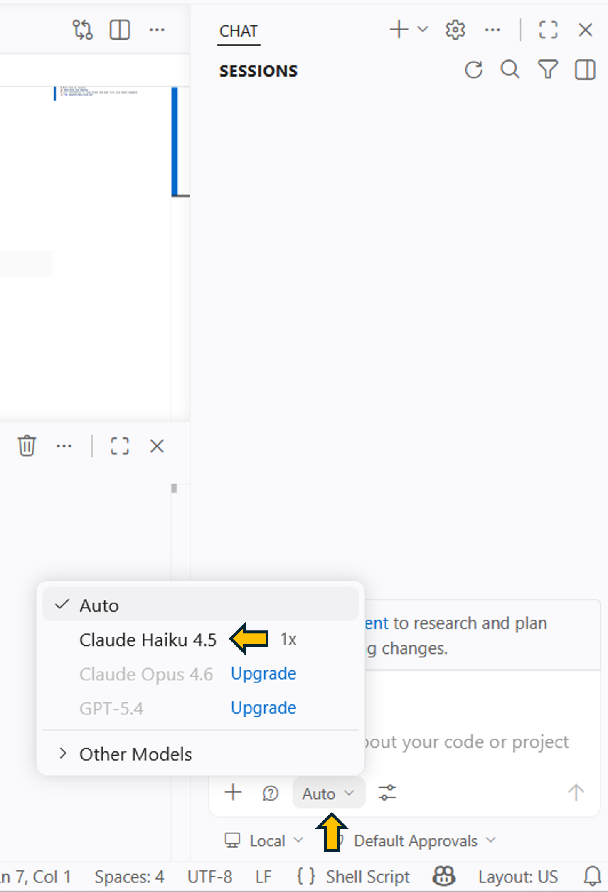

The model is like choosing you flavor of an AI assistant.

You should now see the following configuration: 

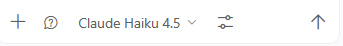

Now, put AI to use!

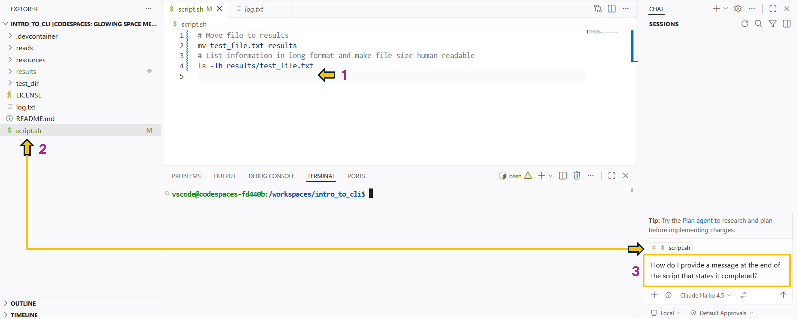

Things to note: 

1) I removed the echo command that I originally had from script.sh
2) Click on script.sh in the file explorer pane to add the file to the chat. Now, when you ask the AI assistant your question, it will answer it in the context of the contents of this file you specified.
3) Provide question to the AI agent and enter


> [!NOTE]
> This echo line works in the sense that it outputs a message, but it's really not an optimal solution.
> A much better solution would be:

```
if [ $? -eq 0 ]; then
    echo "Script completed successfully!"
else
    echo "Script failed!"
    exit 1
fi
```

I encourage you make use of the AI agent to better understand why this is a better solution. Then, really challenge yourself by trying to understand how this "if statement" works and then implement and run it in your script.


>⚠️ **Caution:** Always consult your organization's policy on AI before using it for your own work and data. <br>

For example, GitHub annouced the following:


Meaning, anything you type and data you use to interact with GitHub copilot will be shared with GitHub to better train their AI models **unless you choose to opt out**. I recommend opting out to err on the side of caution. Remember, this tutorial is just toy data that we're using in a public setting. **You have to be much more cautious when using AI with data containing PII/PHI and confidential information related to your institution.**

> [!NOTE] <br>
> You will not need to memorize all of these commands in preparation for the workshop.
> The in-person workshop contains tutorials and format similar to this CLI workshop.

> [!TIP] <br>
> Once you feel more comfortable with the concepts of the command line, you can save time via copying and pasting from code blocks embedded within the tutorial.

Navigate to the original repository for this tutorial, [here](https://github.com/JLC2141/intro_to_cli), and open the README.md file.
 
Find a code block and select the cliboard icon to copy the code:

<br>

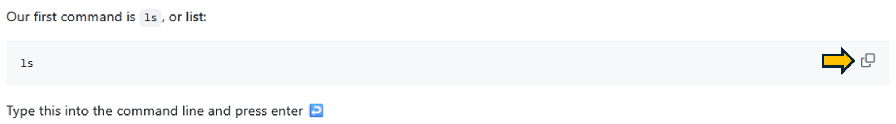

<br>

You should see the "Copied!" confirmation:

<br>

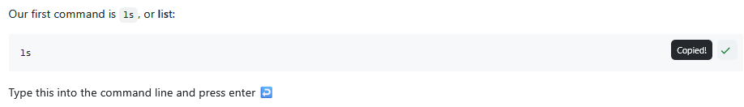

<br>

Navigate to your codespace and press Ctrl+V to paste. You'll be prompted to allow copying and pasting:

<br>


<br>

> [!NOTE] <br>
> This works best on Microsoft Edge or Google Chrome web browsers. **I do not recommend Mozilla Firefox**.

Finally, try to paste, again:

<br>


<br>

**Success! Again, I only recommend this shortcut when you feel more comfortable with the concepts because actively engaging with the code is your best way to learn.**

## Other resources

It is not my intent to inundate you with multiple resources.
With this core foundation you learned here, you now have the tools to explore other CLI commands on your own. 

However, I will share this resource from Data Carpentry: [Introduction to the Command Line for Genomics](https://datacarpentry.github.io/shell-genomics/index.html). 

If interested, I suggest reading through the tutorial to learn a few more commands such as:

* wget/curl
* history
* grep
* for loops


## Deleting your codespace

GitHub Codespaces has a [free quota](https://docs.github.com/en/billing/concepts/product-billing/github-codespaces#free-quota)

Once that is used, you will be charged or prevented from accessing codespaces if no credit card is on file. **The free quota resets every month.**

Let's delete this codespace to make sure that we don't hit this quota.

* Close out of your codespace web browswer tab. From the Github page, select the menu:

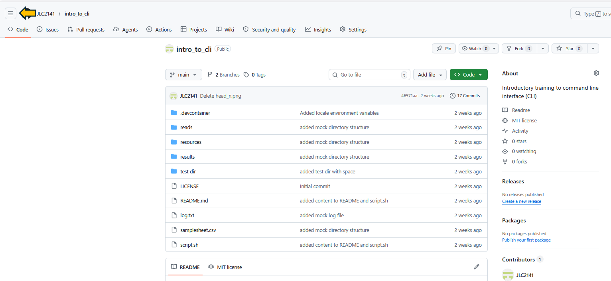

* Then select Codespaces from the dropdown menu:

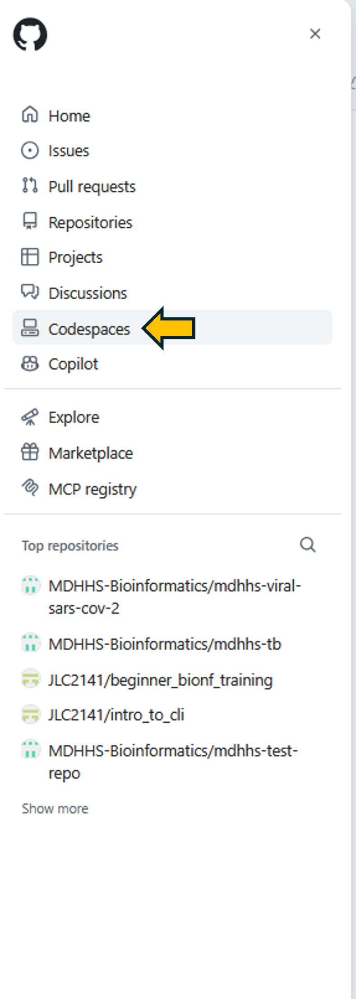

* Select the "more options" icon for your codespace session and then select delete. Confirm deletion.

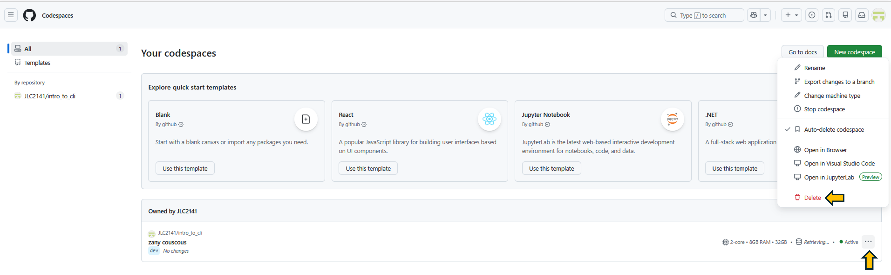


> [!NOTE] <br>
> **You will need to have free quota available for the in-person workshop.** <br>
> If you intend to continue to practice this CLI tutorial asynchronously, I recommend making a second GitHub account (with your gmail, for example).
> Choose one account from which you will practice this CLI tutorial and choose another account that you will only use for the in-person workshop. 


## 👥 Credits

This training module was built and is maintained by the Genomics Analysis Unit at the Michigan Department of Health & Human Services (MDHHS) Bureau of Laboratories.


## ⚠️ Disclaimer
This repository is not a source of government records but is intended to increase collaboration and collaborative potential on public health related projects. Materials and information in this repository are intended to share information and collaboratively develop analysis workflows. 

The workflow reflects the current understanding of the CLI and may be updated as needed and pursuant to further analysis and review. No warranty, expressed or implied, is made by MDHHS Bureau of Laboratories as to the functionality of the software and related material nor shall the fact of release constitute any such warranty. Furthermore, the software is released on condition that the MDHHS Bureau of Laboratories shall not be held liable for any damages resulting from its authorized or unauthorized use. 


## 🔒 Privacy Notice
Use of this service is limited only to non-sensitive and publicly available data. Users must not use, share, or store any kind of sensitive data like health status, provision or payment of healthcare, Personally Identifiable Information (PII) and/or Protected Health Information (PHI), etc. under any circumstance.


## 📜 License
This project is released under the [**MIT License**](LICENSE).